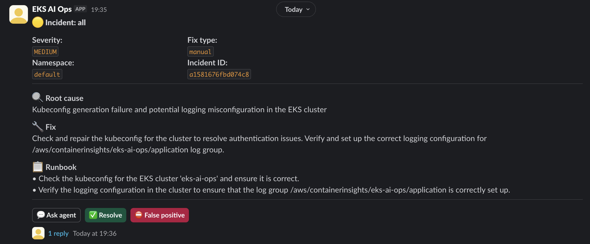
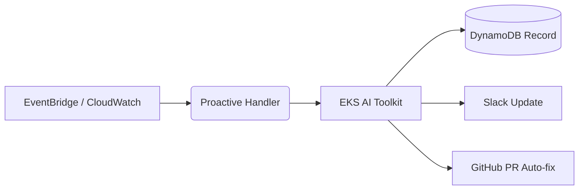
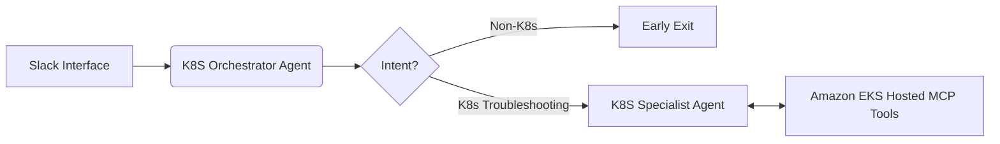

# EKS AI Ops Toolkit

AI-powered Ops Toolkit for EKS featuring proactive incident resolution and an interactive Slack chatbot with MCP/Strands tool calling.



Serverless AI operations toolkit for EKS with two reusable capabilities in one repository:

1. **Proactive AI monitoring**: automatic EKS issue detection, analysis, Slack notification, optional GitHub auto-fix PR.


2. **Interactive Slack bot**: Slack Q&A for EKS troubleshooting using an orchestrator + specialist + MCP-backed tools.

## Architecture

### Proactive flow



### Interactive flow (re:Invent-style semantics)



### Concrete code mapping

- Proactive Lambda entrypoint: `eks_ai_ops.proactive.handler.handler`
- Proactive orchestration: `eks_ai_ops.proactive.flow.ProactiveIncidentFlow`
- Interactive Lambda entrypoint: `eks_ai_ops.interactive.handler.handler`
- **K8S Orchestrator Agent**: `eks_ai_ops.interactive.orchestrator.K8sOrchestratorAgent`
- Intent classifier: `eks_ai_ops.interactive.orchestrator.K8sIntentClassifier`
- **K8S Specialist Agent**: `eks_ai_ops.interactive.strands_agent.InteractiveEKSAgent`
- MCP adapter: `eks_ai_ops.interactive.mcp_tools`
- Backward-compatible wrappers: `eks_ai_ops.handler`, `eks_ai_ops.bot_handler`

## Repository structure

```text
src/eks_ai_ops/
  proactive/
    handler.py
    flow.py
  interactive/
    handler.py
    orchestrator.py
    strands_agent.py
    mcp_tools.py
  shared/
    config.py
    prompts.py
```

## Prerequisites

- Python 3.11+
- AWS account with permissions for Lambda, EventBridge, CloudWatch, DynamoDB, IAM, API Gateway
- Slack workspace where you can create/install apps
- Optional:
  - Bedrock access for Nova/Claude models
  - Strands SDK (`pip install -e ".[strands]"`)
  - MCP gateway that exposes EKS tools

## Installation

```bash
cp .env.template .env
pip install -e ".[dev]"
```

Optional specialist backend extras:

```bash
pip install -e ".[strands]"
```

## Environment variables

Use `.env.template`.

### Shared

- `AWS_REGION` (default: `us-east-1`)
- `LLM_PROVIDER` (`bedrock` or `anthropic`)
- `BEDROCK_MODEL_ID`
- `CLUSTER_NAME`
- `INCIDENT_TABLE`
- `DEPLOY_TABLE`

### Slack

- `SLACK_BOT_TOKEN`
- `SLACK_CHANNEL`
- `SLACK_SIGNING_SECRET`

### Proactive flow

- `GITHUB_TOKEN`
- `GITHUB_REPO`
- `GITHUB_BASE_BRANCH`
- `KUBECTL_LAMBDA`

### Interactive flow

- `INTERACTIVE_AGENT_BACKEND` (default `strands`)
- `EKS_MCP_SERVER` (default `eks`)
- `MCP_GATEWAY_URL`
- `MCP_GATEWAY_API_KEY` (optional)
- `INTENT_USE_LLM` (`false` by default)
- `INTENT_MODEL_ID` (default: `us.amazon.nova-micro-v1:0`)

## MCP gateway (interactive bot)

The interactive specialist calls Kubernetes tools through an HTTP MCP gateway.
Set `MCP_GATEWAY_URL` to a service that accepts:

```text
POST {MCP_GATEWAY_URL}/tools/call
{ "server": "eks", "tool": "list_pods", "arguments": { "namespace": "api" } }
```

Tools dispatched today: `list_pods`, `describe_resource`, `get_pod_logs`
(see `src/eks_ai_ops/interactive/mcp_tools.py`).

If `MCP_GATEWAY_URL` is empty, the bot still answers via the LLM-only fallback —
useful for a first run without standing up a gateway. Add an API key with
`MCP_GATEWAY_API_KEY` if your gateway requires bearer auth.

### Picking a gateway

`MCP_GATEWAY_URL` is **not** an AWS-managed endpoint — it's whatever HTTP
service speaks the contract above. Options, easiest first:

1. **AWS Labs `eks-mcp-server`** (recommended) — official open-source MCP
   server with EKS-aware tools. It speaks MCP-over-stdio out of the box, so
   you wrap it behind a thin HTTP shim that translates `POST /tools/call` →
   MCP `tools/call`. Repo: <https://github.com/awslabs/mcp> (see
   `src/eks-mcp-server/`).
2. **Self-host the shim on AWS:**
   - **App Runner** — simplest. Push a container, get an HTTPS URL, point
     `MCP_GATEWAY_URL` at it.
   - **ECS Fargate behind ALB** — if you need VPC peering with EKS.
   - **Lambda + Function URL** — fine for low traffic; cold starts add latency.
3. **kubectl in-VPC** — `KubectlHelperFunction` already runs inside the EKS
   VPC and can reach the cluster API. The MCP gateway can delegate to it for
   real `kubectl` calls (this is how the AWS Labs server talks to the cluster
   too).

Auth: store any API key in SSM as `/eks-ai-ops-toolkit/mcp-gateway-api-key`
(SecureString) and add a corresponding parameter mapping to
`infrastructure/template.yaml` if you want it injected automatically. Until
then `MCP_GATEWAY_API_KEY` is read from the Lambda environment.

> **Quickest path:** skip the gateway. The Slack bot will answer Kubernetes
> questions from Bedrock alone. Add the gateway later when you want the bot
> to actually run `kubectl` against a cluster.

## Kubectl helper VPC (SSM parameters)

The `KubectlHelperFunction` Lambda runs inside the EKS VPC so it can reach the
cluster API. Before `make deploy` you must publish three SSM parameters:

```bash
aws ssm put-parameter --name /eks-ai-ops-toolkit/eks-vpc-id \
  --value vpc-xxxxxxxx --type String --overwrite
aws ssm put-parameter --name /eks-ai-ops-toolkit/eks-private-subnet-1 \
  --value subnet-aaaaaaaa --type String --overwrite
aws ssm put-parameter --name /eks-ai-ops-toolkit/eks-private-subnet-2 \
  --value subnet-bbbbbbbb --type String --overwrite
```

Use private subnets that have a route to the EKS control plane and to NAT for
pulling Bedrock/STS endpoints.

## Engineer journey 1: Greenfield (AWS + Slack only)

### Step 1: Create/configure Slack app

1. Create app in Slack API console.
2. Add bot scopes:
   - `chat:write`
   - `app_mentions:read`
   - `channels:history`
3. Enable Event Subscriptions.
4. Subscribe to `app_mention`.
5. Enable Interactivity.
6. Install app into workspace and invite bot to your target channel.

### Step 2: Configure AWS secrets (SSM)

Use helper target:

```bash
make setup-ssm
```

### Step 3: Build and deploy with SAM

```bash
make build
make deploy
```

After deploy, capture `SlackBotEndpoint` from stack outputs and set it in:
- Slack Event Subscriptions Request URL
- Slack Interactivity Request URL

### Step 4: Verify end-to-end

- Trigger/emit an alarm event and confirm proactive Slack alert appears.
- Mention bot in thread with EKS question and verify orchestrator route behavior.

## Engineer journey 2: Existing EKS project wants SlackBot + AI monitoring

### Step 1: Keep current EKS; integrate this stack

- Reuse existing cluster name by passing `ClusterName` parameter on deploy.
- Reuse existing alarm conventions or route your existing events into EventBridge patterns expected by template.

### Step 2: Connect to existing ops repositories

- Set `GITHUB_REPO` to infra repo where you want auto-fix PRs.
- Keep PR auto-merge disabled; human review remains required.

### Step 3: Integrate MCP gateway for interactive troubleshooting

- Point `MCP_GATEWAY_URL` to your existing EKS MCP service.
- Set `EKS_MCP_SERVER` if your MCP server identifier differs from default.

### Step 4: Roll out safely

- Deploy to a non-prod Slack channel first.
- Validate non-K8s questions are exited by orchestrator.
- Validate K8s troubleshooting questions route to specialist and use MCP tools.

## GitHub Actions (CI/CD)

The repository includes GitHub Actions workflows for continuous integration (`ci.yml`) and automated deployment (`deploy.yml`).

- **Continuous Integration (`ci.yml`):** Runs automatically on every push and pull request to `main` to run linting and tests.
- **Automated Deployment (`deploy.yml`):** By default, this workflow is set to `workflow_dispatch` (disabled from running automatically) to prevent unexpected AWS deployments if you are just evaluating the toolkit locally.

### How to Enable Automated Deployments

If you want the pipeline to automatically deploy your infrastructure on merge:
1. **Enable Triggers:** Edit `.github/workflows/deploy.yml`. Change `on: workflow_dispatch:` to:
   ```yaml
   on:
     push:
       branches: [ main ]
   ```
2. **Set Secrets in GitHub:** Go to your repository **Settings > Secrets and variables > Actions**.
   - Add a repository variable `AWS_REGION` (e.g., `us-east-1`).
   - Add a repository variable `EKS_CLUSTER_NAME`.
   - Add a repository variable `SLACK_CHANNEL`.
   - Add a repository variable `GITHUB_REPO`.
   - Add a repository secret `AWS_DEPLOY_ROLE_ARN` (An IAM Role ARN configured for GitHub OIDC to deploy the SAM stack).

Once configured, the CI pipeline will run Ruff/Pytest on every PR, and the Deploy pipeline will build and update your AWS SAM stack whenever code is merged to `main`.

## Local run and testing

### Run checks

```bash
ruff check src tests
python -m compileall src tests
pytest --no-cov
```

### Run focused architecture tests

```bash
pytest --no-cov tests/test_orchestrator.py tests/test_bot_handler.py
```

### Local proactive invoke example

```bash
python -c "
from eks_ai_ops.proactive.handler import handler
event = {
  'source': 'aws.cloudwatch',
  'detail': {
    'alarmName': 'sre-prod-api-checkout-error-rate-high',
    'state': {'value': 'ALARM', 'reason': 'Threshold crossed'},
    'previousState': {'value': 'OK'},
    'configuration': {}
  }
}
print(handler(event, None))
"
```

### Local observation tip (k9s)

While testing in a real cluster, use `k9s` to watch pod logs and events in parallel with Slack interactions.
This makes it easier to verify whether orchestrator routing and specialist troubleshooting outputs match live cluster state.

## Deploy commands summary

```bash
make install
make test-fast
make build
make deploy
```

If already configured and iterating:

```bash
make deploy-fast
```
