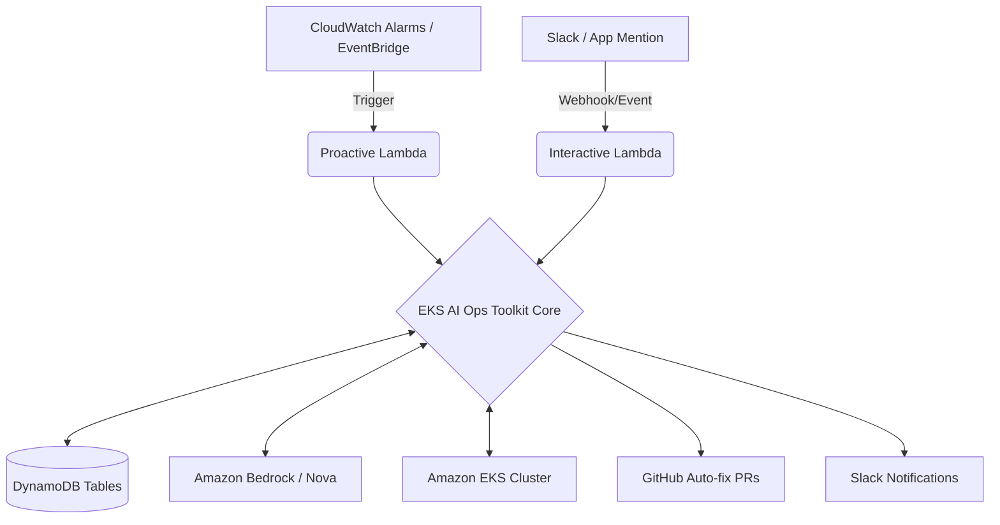

# Infrastructure

This folder contains the AWS SAM (Serverless Application Model) templates used to deploy the EKS AI Ops Toolkit.

## Architecture Diagram

To deploy the infrastructure, use `make deploy` from the root directory.
